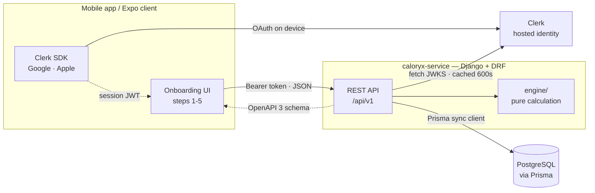
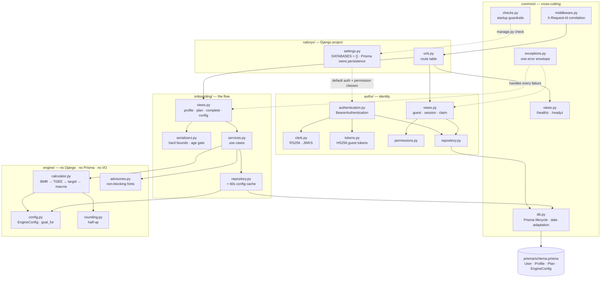
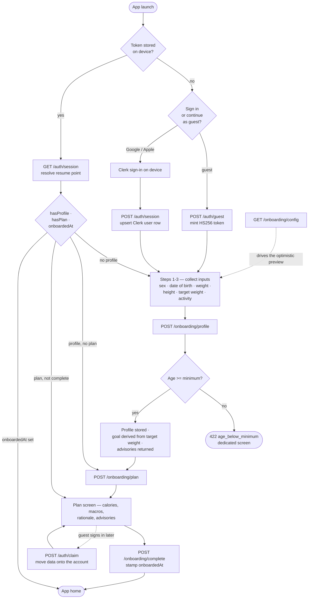
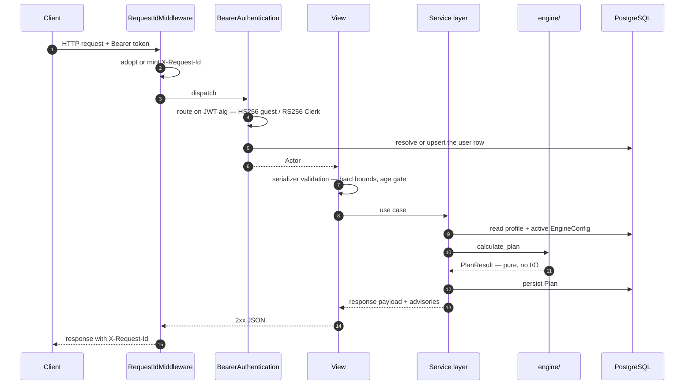
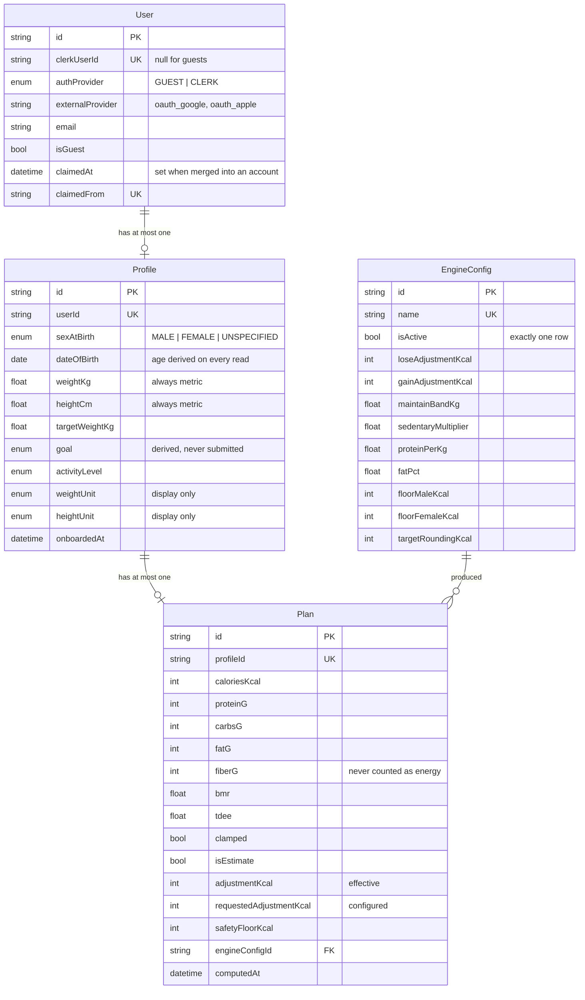
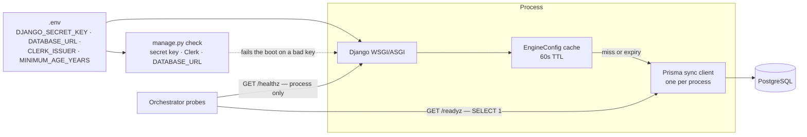

# CaloryX Backend — High-Level Flow

A bird's-eye view of `caloryx-service`: who talks to it, what the pieces are,
and the path a user takes through onboarding. For call-by-call detail — token
routing, the engine pipeline, transaction boundaries — see
[`low-level-flow.md`](./low-level-flow.md).

Section references (§) point into *CaloryX — Onboarding Feature PRD v1.1*.

---

## 1. System context

Clerk performs the OAuth exchange on the device, so no provider secret ever
reaches this service — it only verifies the resulting session JWT against
Clerk's JWKS. Guest mode has no Clerk identity, so the service mints its own
HS256 token instead.



**Direction of trust.** Everything inbound carries a bearer token; the service
never calls the device. The only outbound dependency is Clerk's JWKS endpoint,
and a failure there degrades signed-in auth only — guest sessions keep working.

---

## 2. Component map



**The one hard boundary.** `engine/` imports nothing from Django, Prisma, or the
rest of the service. It receives a `PlanInput` plus an `EngineConfig` and returns
a `PlanResult`. Lifting it into a standalone process later means adding a
transport, not rewriting callers.

---

## 3. The onboarding journey

Every endpoint accepts guest and Clerk sessions alike (§8), so the flow below is
identical whether the user signed in first or started anonymously.



**Three things this diagram encodes that are easy to get wrong:**

- **The goal is never asked for.** It is derived server-side from
  `targetWeightKg` against `weightKg` (§5.3), which is why `targetWeightKg` is
  required rather than optional.
- **Advisories do not block.** Out-of-range-but-plausible input, an underweight
  target, a clamped calorie floor — all come back alongside a `200`, because
  onboarding speed and completion are the core metrics (§9). The one exception
  is the age gate, which blocks with `422`.
- **Resume is server-driven.** `hasProfile` / `hasPlan` / `onboardedAt` from
  `/auth/session` map onto the last incomplete step (§4); the client stores no
  progress of its own.

---

## 4. Request lifecycle, coarse



Any exception anywhere in that chain lands in `common.exceptions.api_exception_handler`
and comes back as one envelope, so the client has a single shape to branch on:

```json
{ "error": { "code": "profile_required", "message": "…", "details": {}, "requestId": "…" } }
```

---

## 5. Data model



Every `Plan` records the `engineConfigId` that produced it, so a stored plan
stays explainable after the constants are retuned (§10).

---

## 6. Configuration and deployment



**Tuning without an app release.** Multipliers, goal adjustments, macro ratios,
safety floors and rounding live in the `EngineConfig` table. A retune goes live
within one cache TTL, with no deploy:

```bash
python manage.py engine_config --show
python manage.py engine_config --name v1 --set loseAdjustmentKcal=-350 --activate
```

A config lookup that fails falls back to the compiled defaults rather than
costing a user their plan.

---

## 7. Endpoint summary

| Method | Path | Auth | Purpose |
|---|---|---|---|
| `POST` | `/api/v1/auth/guest` | none, throttled | Mint an anonymous session |
| `GET`/`POST` | `/api/v1/auth/session` | any session | Identity + resume point |
| `POST` | `/api/v1/auth/claim` | Clerk only | Move guest data onto the account |
| `GET`/`POST` | `/api/v1/onboarding/profile` | any session | Read / upsert the inputs |
| `POST` | `/api/v1/onboarding/plan` | any session | Compute and persist the plan |
| `GET` | `/api/v1/onboarding/plan` | any session | Fetch the stored plan |
| `POST` | `/api/v1/onboarding/complete` | any session | Stamp `onboardedAt` |
| `GET` | `/api/v1/onboarding/config` | none | Engine constants + validation bounds |
| `GET` | `/healthz` · `/readyz` | none | Liveness / readiness |
| `GET` | `/api/schema` · `/docs` · `/redoc` | none | OpenAPI 3 + docs UIs |
