# CaloryX Backend — Low-Level Flow

Call-by-call detail: how a token is routed, what each endpoint does in order,
how the engine turns a profile into a plan, and where every failure lands. The
architectural overview lives in [`high-level-flow.md`](./high-level-flow.md).

Section references (§) point into *CaloryX — Onboarding Feature PRD v1.1*.

---

## 1. Middleware and DRF pipeline

Every `/api/v1` request passes through the same chain before a view body runs.

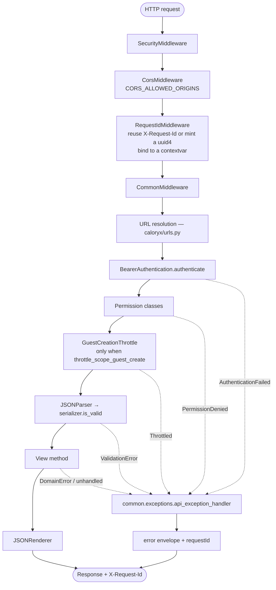

The request id is bound to a `contextvars.ContextVar`, so `RequestIdLogFilter`
stamps it onto every log line and `api_exception_handler` stamps it onto every
error body. One mobile trace is followable end to end.

**Route-level auth overrides.** The defaults are `BearerAuthentication` +
`IsAuthenticatedActor`. Three routes opt out — `POST /auth/guest` and
`GET /onboarding/config` set `authentication_classes = []` with `AllowAny`, and
the schema/docs views do the same so CI can fetch the OpenAPI document without a
token. `POST /auth/claim` tightens instead, to `IsRegisteredActor`.

---

## 2. Bearer token routing

One header, two token families. The signing algorithm routes it, so the client
never declares which kind it holds (§8).

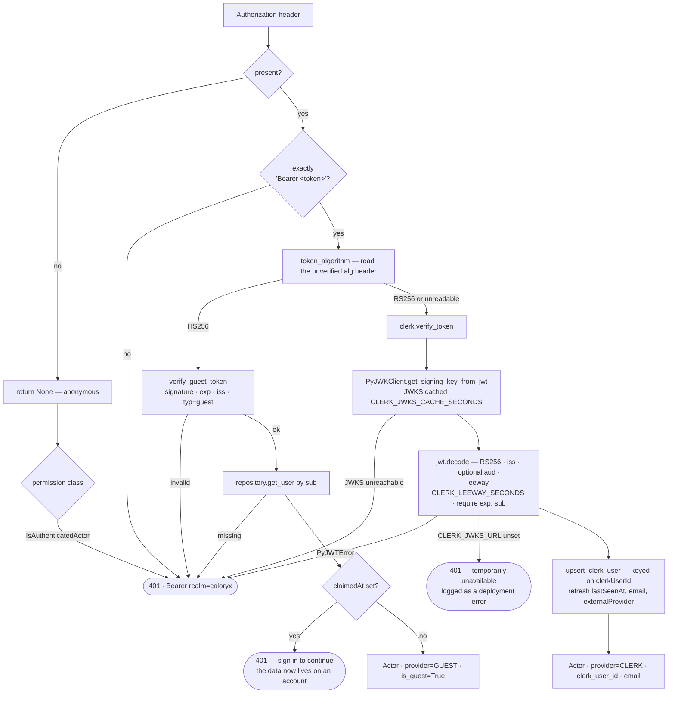

**Why `Actor` and not Django's `User`.** Prisma owns persistence and `DATABASES`
is empty, so `request.user` is a frozen `Actor` dataclass carrying everything a
view needs to authorise without a second round trip. `UNAUTHENTICATED_USER` is
set to `None` so Django's `AnonymousUser` never drags in the auth app's tables.

**A claimed guest token returns 401 by design.** That is the client's signal to
fall back to the Clerk session, not an error to retry.

---

## 3. `POST /auth/guest`

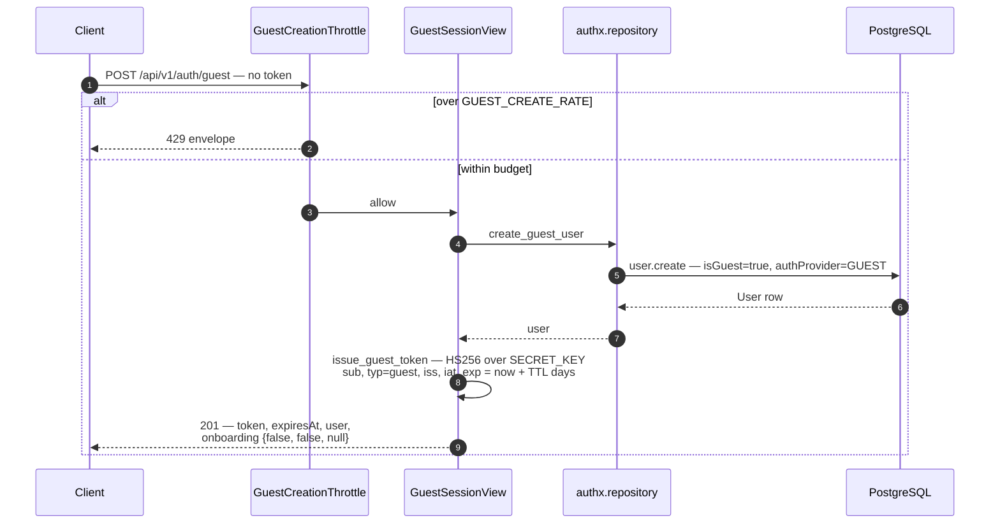

The guest row holds no personal data until the user claims it. The token asserts
nothing beyond "this device owns anonymous user X" — which is exactly why
`common/checks.py` fails `manage.py check` on the built-in development
`SECRET_KEY`: it is what stands between an attacker and a forged guest session.

Guest creation is the one unauthenticated write in the service, so it is the one
endpoint throttled out of the box. `GuestCreationThrottle` applies per view via
the `throttle_scope_guest_create` flag, not globally.

---

## 4. `GET`/`POST /auth/session`

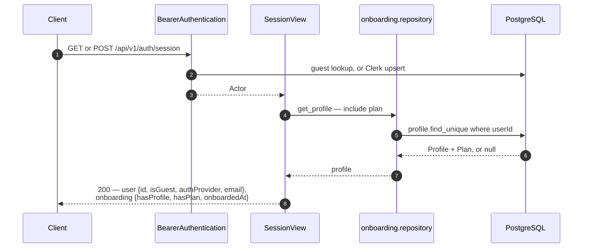

`GET` and `POST` share one body. The distinction is intent, not behaviour: `POST`
is the sign-in hand-off — the first authenticated call is what creates or
refreshes the Clerk-backed row inside `authenticate` — while `GET` is the cheap
resume check on launch.

The three `onboarding` booleans are the whole of the resume contract (§4):

| `hasProfile` | `hasPlan` | `onboardedAt` | Client resumes at |
|---|---|---|---|
| `false` | `false` | `null` | Step 1 — collect inputs |
| `true` | `false` | `null` | Plan generation |
| `true` | `true` | `null` | Plan screen |
| `true` | `true` | set | App home |

---

## 5. `POST /onboarding/profile`

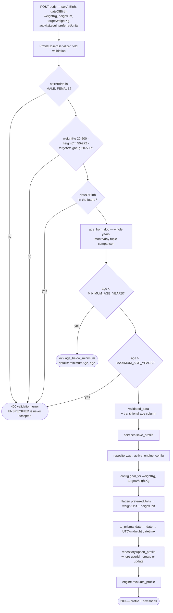

**Four details worth carrying in your head:**

- **`goal` is not a request field.** It is derived in the service layer, not the
  serializer, because the `MAINTAIN` band is server-tunable config and the
  serializers stay clear of the repository. `get_active_engine_config` is cached
  and falls back to compiled defaults, so this cannot cost a profile save.
- **`preferredUnits` is nested on the wire and two columns in the database.**
  Flattening happens in the service so `upsert_profile` stays a blind
  pass-through into Prisma.
- **`to_prisma_date` is load-bearing.** Prisma's argument serializer knows
  `datetime` but not `date`; a bare `date` used to crash the endpoint with a
  500. Both legs are pinned to UTC — a birth date is a calendar fact, and
  converting through a local zone shifts the day (and, on a birthday, the derived
  age) for anyone west of UTC.
- **The upsert is idempotent.** A user stepping back and forth through the flow
  (§4) never creates a second profile.

### Goal derivation (§5.3)

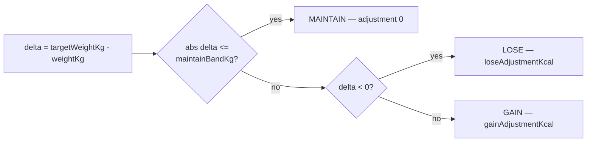

The band matters in both directions: someone holding steady should not have to
type their weight to the decimal, and a difference the size of a rounding error
must not silently buy a 400 kcal deficit.

---

## 6. `POST /onboarding/plan` — the engine pipeline

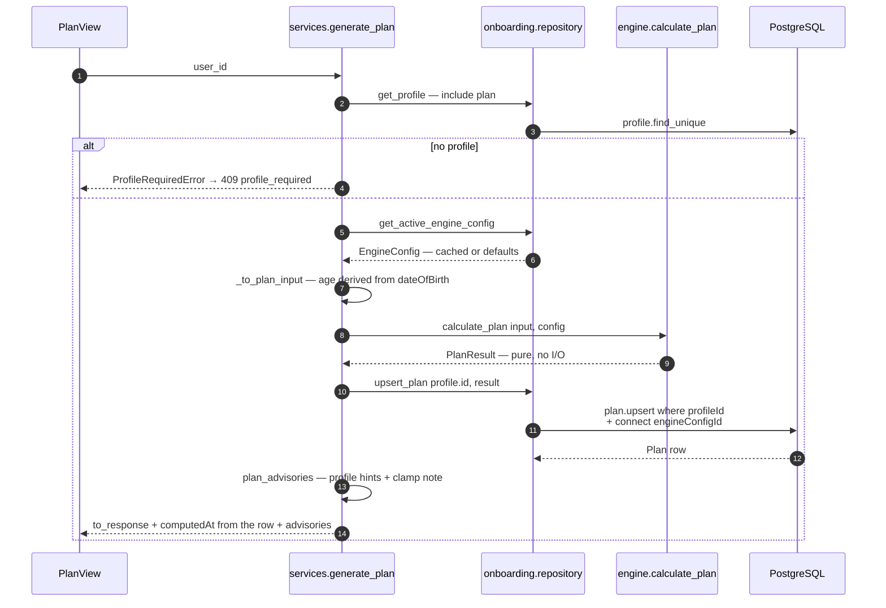

`computedAt` is read back from the persisted row rather than a fresh `now()`, so
a client caching the POST payload ages it against the same instant the database
holds — and the POST and GET shapes stay identical field for field.

### Inside `calculate_plan` (§6.1–§6.3)

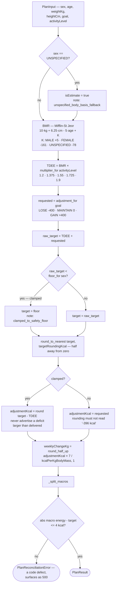

### Macro split (§6.3)

Macros are derived *from* the calorie target, which is what makes them
self-reconcile.

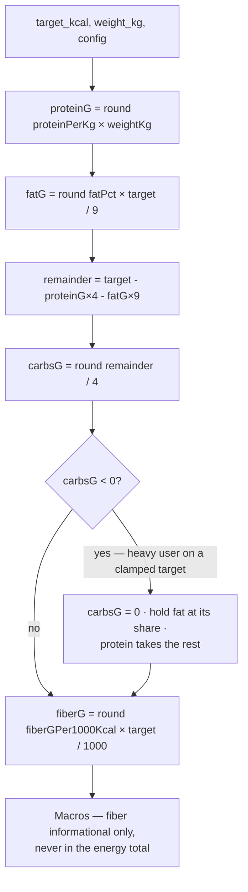

Fiber is deliberately absent from `macroEnergyKcal`: it is a subset of
carbohydrate grams and must never reach an energy ring (§5.5).

### Worked example (§6.5)

> Male · 30 yrs · 180 cm · 90 kg · Sedentary · Lose
>
> BMR `10(90) + 6.25(180) − 5(30) + 5` = **1,880**
> TDEE `1,880 × 1.2` = **2,256**
> Raw target `2,256 − 400` = 1,856 → rounded to 10 → **1,860 kcal**
> Protein `1.8 × 90` = 162 g · Fat `0.25 × 1860 / 9` = 52 g ·
> Carbs `(1860 − 648 − 468) / 4` = 186 g · Fiber `15 × 1.86` = 28 g
> Reconcile `648 + 744 + 468` = **1,860 ✓**

### Rounding

`engine/rounding.py` is half-**up**, not Python's default half-to-even, because
the client renders an optimistic preview that must reconcile with the server
value (§5.5) and JavaScript's `Math.round` is half-up. `round(2.5)` is `2` in
Python and `3` in JS; standardising on half-away-from-zero removes the
disagreement on boundary cases.

---

## 7. `GET /onboarding/plan` — resume, with self-healing

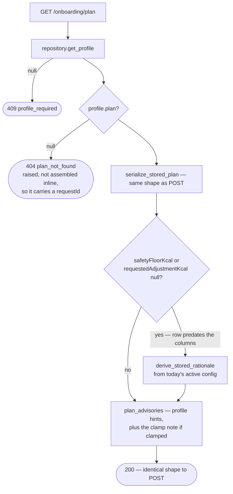

Two deliberate choices here:

- **One serializer for POST and GET.** They were separate once and drifted
  twice — the stored form first lost the §6.2 clamp fields, costing a resumed
  plan its explanation, then lagged behind on `computedAt`.
- **Healing is a stopgap, not the fix.** `manage.py backfill_plan_rationale` is
  what actually clears those nulls; healing here keeps the response well-formed
  in the meantime, at the cost of using today's config rather than the one that
  produced the plan.

Similarly, `plan_advisories` is shared between the compute and resume paths.
They used to assemble the list separately, and the resume path forgot the clamp
advisory — so a user held at the floor saw the explanation once and never again.

---

## 8. `POST /onboarding/complete`

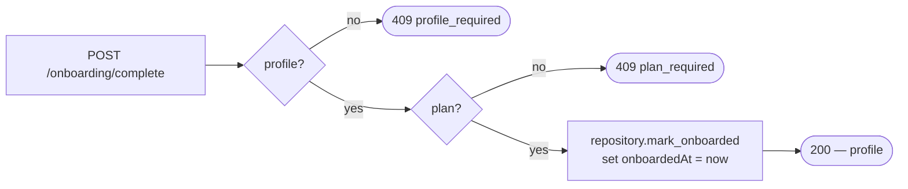

Both failures are `409`; they differ only by `code`, and they route to different
screens. Branch on `code`, never on the status. "You're all set" should never be
reachable without a plan — a missing one here means the client skipped a step.

---

## 9. `POST /auth/claim`

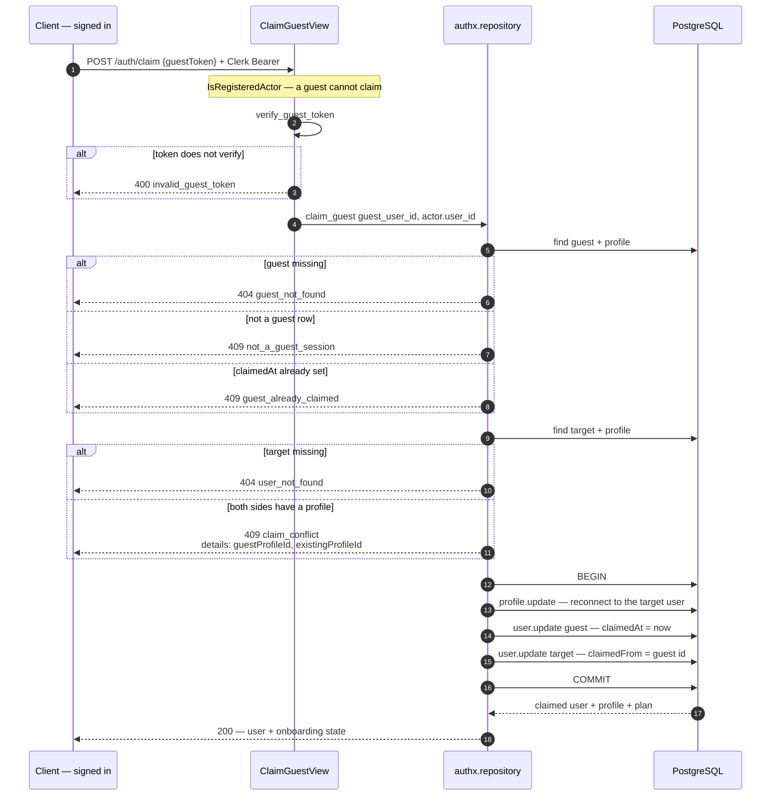

All three writes are one transaction: a half-applied claim would leave a profile
pointing at an account whose `claimedFrom` was never set. The conflict case
**refuses rather than merges** — two real profiles is a product decision, not
something to resolve silently.

From the next request onward the guest token returns `401`, which is the
client's cue to use the Clerk session.

---

## 10. `GET /onboarding/config` and cache behaviour

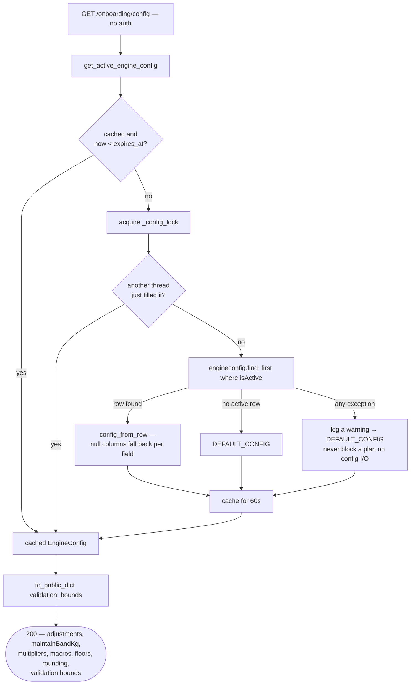

**Why the bounds travel with the config.** `validation_bounds()` reads the same
constants the serializers enforce and the age limits straight from settings, so
the client can stop a bad value at the field instead of discovering it as a 400
four screens later. They are injected into `to_public_dict` rather than read
inside it, because `engine/` imports neither Django nor the serializers.
`tests/test_config_bounds.py` fails if what is advertised stops matching what is
enforced.

**Why `deepcopy`.** The bounds are nested one level and the payload may well be
cached; a shallow copy would leave the caller holding a handle into it.

`invalidate_engine_config_cache()` is called by `manage.py engine_config` so a
retune in the same process is visible immediately rather than up to a TTL later.

---

## 11. Advisories (§9)

Non-blocking by construction: every one of these rides alongside a `200`.

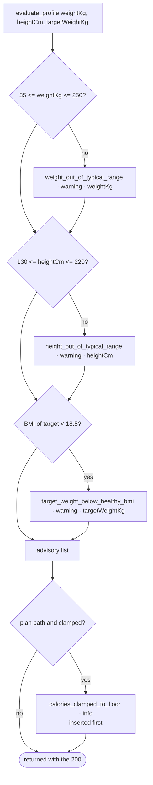

**Soft versus hard bounds.** The soft ranges above only warn; the hard
physiological caps in `onboarding/serializers.py` (`weightKg` 20–500,
`heightCm` 50–272) reject with a `400`. The safety floor protects the daily
number; the BMI safeguard protects the goal itself.

**The `options` field.** An advisory may carry one-tap `{id, label, patch}`
options so the server never silently auto-corrects. None does today —
`goal_target_weight_conflict` was the only one that ever did, and deriving the
goal from the target weight made it impossible. The shape stays in the contract
so the next advisory that needs it is not a breaking type change for generated
clients, and `tests/test_advisories.py` enforces that every `patch` key is a real
`ProfileUpsertSerializer` field.

---

## 12. Error handling

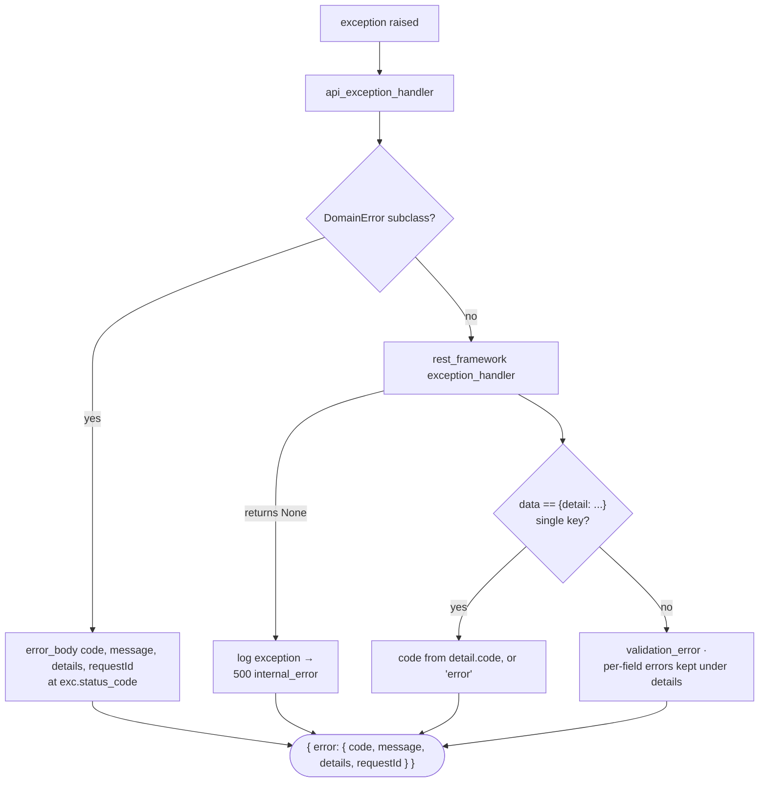

| Exception | Code | Status |
|---|---|---|
| `AgeBelowMinimumError` | `age_below_minimum` | 422 |
| `ProfileRequiredError` | `profile_required` / `plan_required` | 409 |
| `ConflictError` | `claim_conflict`, `not_a_guest_session`, `guest_already_claimed` | 409 |
| `NotFoundError` | `plan_not_found`, `guest_not_found`, `user_not_found` | 404 |
| `DomainError` | `invalid_guest_token` | 400 |
| DRF `ValidationError` | `validation_error` | 400 |
| DRF auth failure | derived from `detail.code` | 401 / 403 |
| DRF `Throttled` | derived from `detail.code` | 429 |
| `UpstreamUnavailableError` | `upstream_unavailable` | 503 |
| anything unhandled | `internal_error` | 500 |

`api_exception_handler` imports DRF's handler inside the function body, not at
module scope: `rest_framework.views` resolves `DEFAULT_AUTHENTICATION_CLASSES` on
import, which imports `authx`, which imports this module.

---

## 13. Prisma client lifecycle

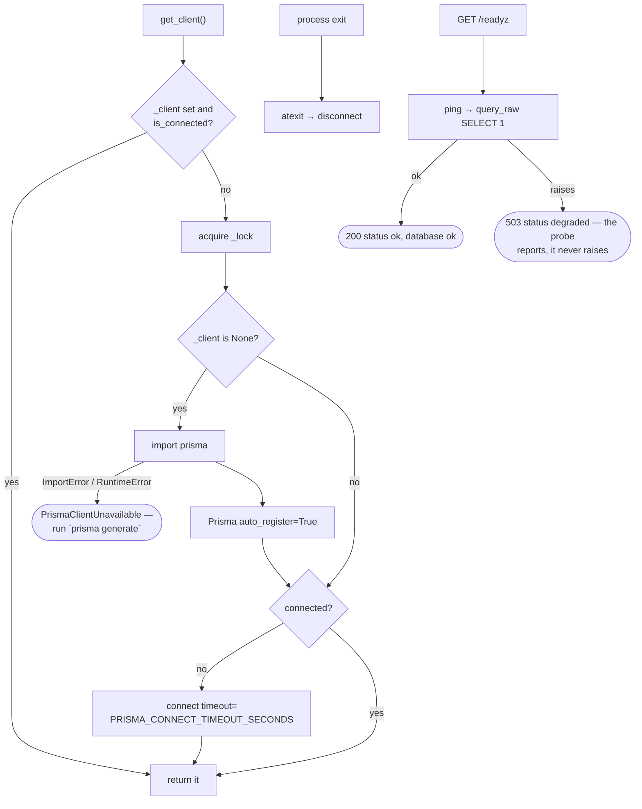

One process-wide **sync** client, matching Django's WSGI request model. The
underlying query engine handles its own connection pool, so a second client
would just multiply pools. `/healthz` deliberately does not touch the database —
liveness is "the process is up", readiness is "it can serve traffic".

### Date adaptation across the Prisma boundary

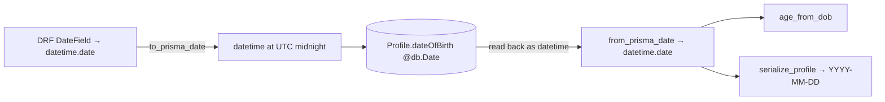

The generated client types even a `@db.Date` column as `Optional[datetime]` on
both input and output, so dates cross this boundary as datetimes in both
directions. Both legs are pinned to UTC and neither ever touches local time.

---

## 14. Startup checks and migrations

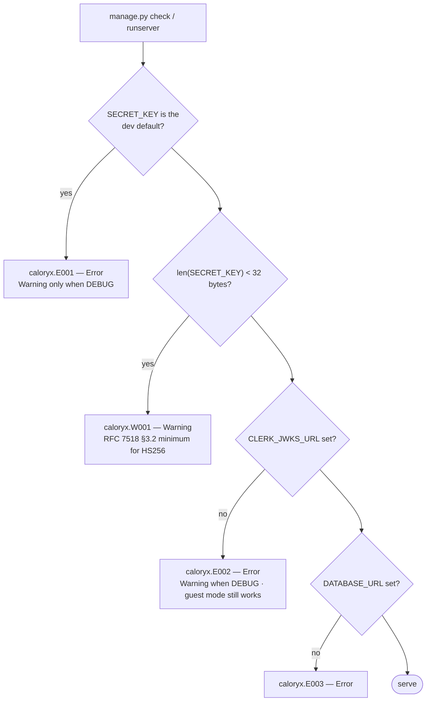

### Transitional columns

Three columns are mid-migration. Each has an expand-migrate-contract backfill
that must run before the old column is dropped.

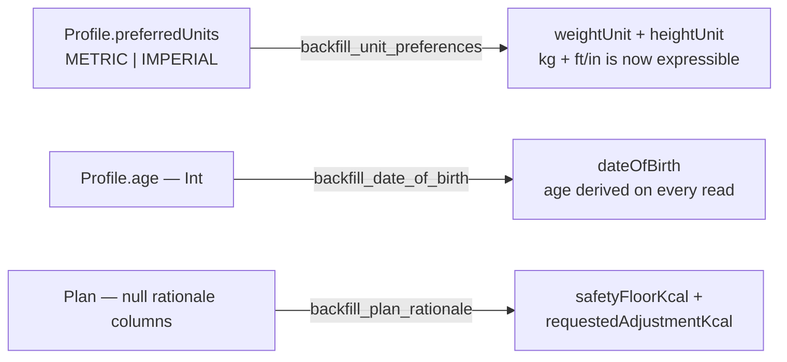

Run each with `--dry-run` first. `age` and `preferredUnits` are then droppable in
a single contract-phase push.

---

## 15. Testing seams

The suite needs no database and no generated Prisma client. Three seams make
that work:

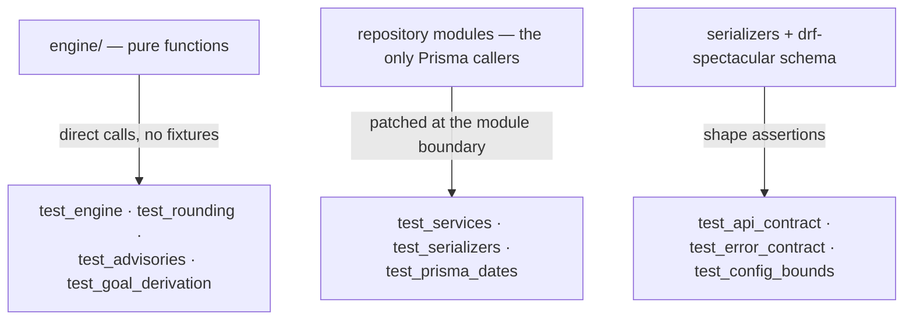

Because every Prisma call funnels through a repository module, patching that
module is enough to exercise the full service and view layers. `test_prisma_dates`
exists specifically because the read side once drifted on the coincidence that
`datetime` subclasses `date`.
